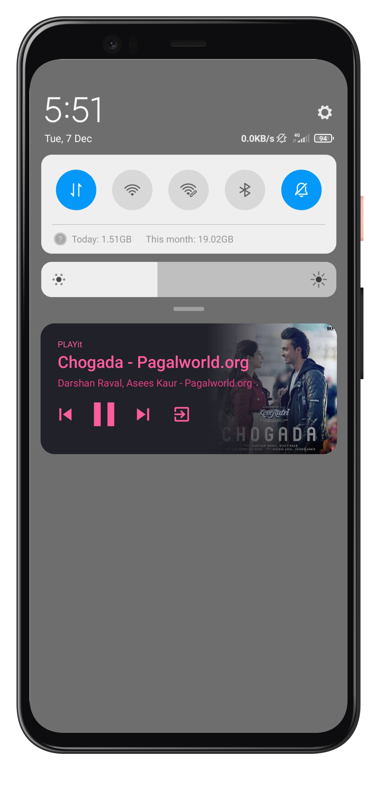

#PLAYit App
PLAYit is Audio media Player build using kotlin.The goal of this project is to implement an simple audio media app that works across multiple form factors and provide a consistent user experience on Android phones.It access the audio files available in device and play it using our player it also run in background.This well-maintend APK perform all basic functionality of any Audio Media Player.

##### Download APK

### Screenshot
&nbsp;&nbsp;&nbsp;&nbsp;&nbsp;&nbsp;&nbsp;      &nbsp;&nbsp;&nbsp;&nbsp;&nbsp;&nbsp;&nbsp;       

&nbsp;&nbsp;&nbsp;&nbsp;&nbsp;&nbsp;&nbsp;      &nbsp;&nbsp;&nbsp;&nbsp;&nbsp;&nbsp;&nbsp;       

### Features

* Simple audio focus management
* Control audio from notification
* Dynamic Shuffling
* Repeat audio
* Background play

###  Built With

* RecyclerView
* Fragments
* ViewPager plus TabLayout
* Intent
* MediaStore
* Picasso

##### Made with  by <a href="https://github.com/chintanmarvaniya1">chintanmarvaniya1</a>

